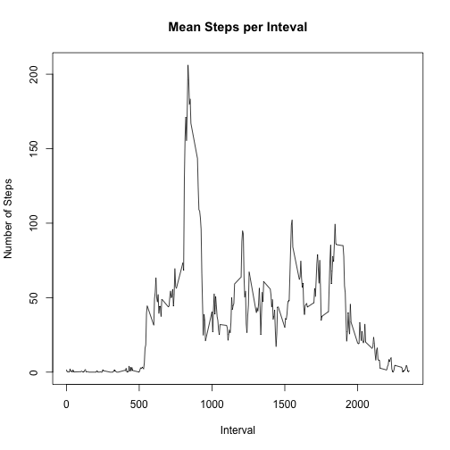

Reproducible Research: Peer Assessment 1
========================================


```r
library(plyr)
library(dplyr, warn.conflicts = FALSE)
library(ggplot2)
```

## Loading and preprocessing the data


```r
activity.data = read.csv(unz("activity.zip", "activity.csv"))

activity.data = mutate(activity.data, date = as.Date(activity.data$date, "%Y-%m-%d"))
```

## What is mean total number of steps taken per day?


```r
total.steps.per.day = ddply(activity.data, .(date), summarize, total.steps = sum(steps))

total.steps = with(total.steps.per.day, total.steps[!is.na(total.steps)])
hist(total.steps, breaks = 10, main = "Histogram of Total Steps", xlab = "Number of Steps")
```


```r
mean.total.steps = mean(total.steps)
print(mean.total.steps)
```

```
## [1] 10766.19
```

```r
median.total.steps = median(total.steps)
print(median.total.steps)
```

```
## [1] 10765
```

The mean total number of steps taken per day is 10766.19, and the median is 10765

## What is the average daily activity pattern?


```r
mean.steps.per.interval = ddply(activity.data, .(interval), summarize, mean.steps = mean(steps, na.rm = T))
with(mean.steps.per.interval, plot(interval, mean.steps, type="l", main = "Mean Steps per Inteval", xlab = "Interval", ylab = "Number of Steps"))
```



```r
max.interval = with(mean.steps.per.interval, interval[which.max(mean.steps)])
print(max.interval)
```

```
## [1] 835
```

The interval with the maximum average number of steps is 835.

## Imputing missing values


```r
total.na = sum(is.na(activity.data$steps))
print(total.na)
```

```
## [1] 2304
```

There are a total of 2304 missing step values. Note that there is only missing data when there are no measurements whatsoever for an entire day. Therefore, we must transplant information from the other days in the dataset. The most reasonable procedure available is to take the mean steps from every recorded interval as the reported steps for missing intervals.  


```r
activity.data.imputed = activity.data
activity.data.imputed$steps[is.na(activity.data.imputed$steps)] = mean.steps.per.interval$mean.steps

total.steps.per.day.imputed = ddply(activity.data.imputed, .(date), summarize, total.steps = sum(steps))
total.steps.imputed = total.steps.per.day.imputed$total.steps
hist(total.steps.imputed, breaks = 10, main = "Histogram of Total Steps with Imputed Values", xlab = "Number of Steps")
```


```r
mean.total.steps.imputed = mean(total.steps.imputed)
print(mean.total.steps.imputed)
```

```
## [1] 10766.19
```

```r
median.total.steps.imputed = median(total.steps.imputed)
print(median.total.steps.imputed)
```

```
## [1] 10766.19
```

The mean total steps taken per day is still 10766.19, but the median is now 10766.19, the same as the mean. This makes sense, as we've added eight more days to the dataset where the total number of steps is equal to the mean number of steps. This is clearly visible in the new histogram.  

## Are there differences in activity patterns between weekdays and weekends?


```r
day.of.week =
    as.factor(ifelse(weekdays(activity.data.imputed$date) %in% c("Saturday", "Sunday"), "weekend", "weekday"))

activity.data.imputed$day.of.week = day.of.week
mean.steps.per.interval.imputed = 
    ddply(activity.data, .(day.of.week, interval), summarize, mean.steps = mean(steps, na.rm = T))
with(mean.steps.per.interval.imputed, qplot(interval, as.integer(mean.steps), geom="line", facets = (day.of.week ~ .), main = "Mean Steps per Inteval with Imputed Values", xlab = "Interval", ylab = "Number of Steps"))
```


